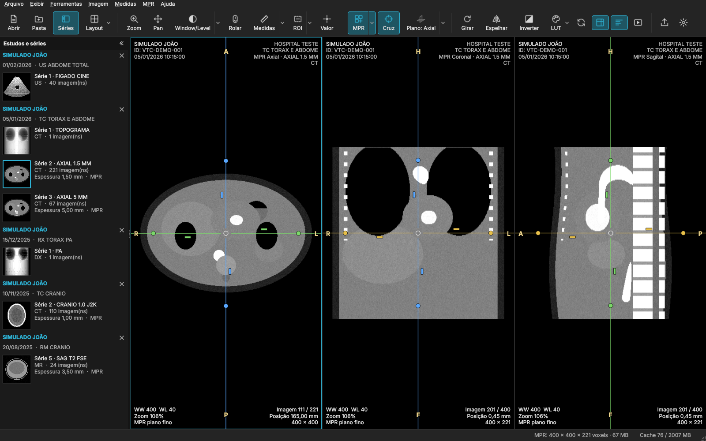
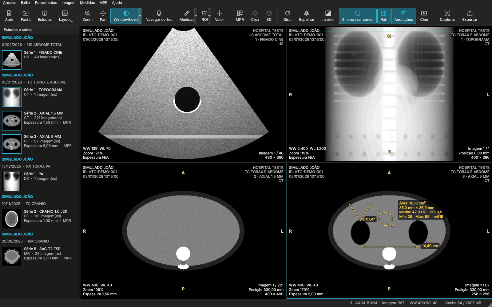
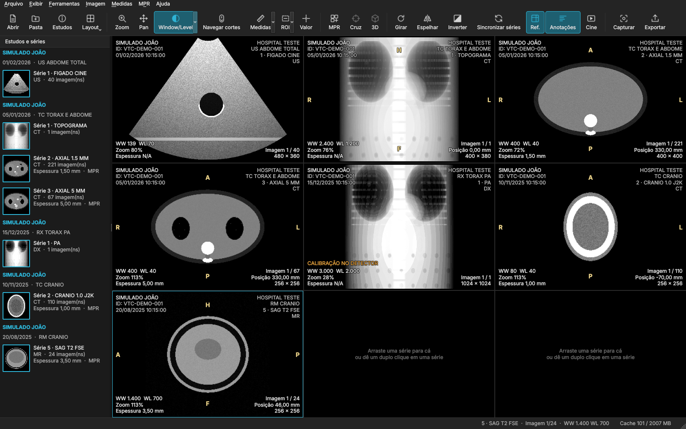

# VisualTC — DICOM Medical Image Viewer

Visualizador DICOM desktop, nativo e **totalmente offline**, para tomografia
computadorizada, ressonância magnética e demais modalidades. O fluxo é simples:
o usuário abre (ou arrasta) a pasta do exame, o VisualTC encontra os arquivos
DICOM, organiza paciente, estudos e séries e exibe as imagens em segundos.
Não há servidor, PACS ou configuração.

## ⬇️ Baixar

| Seu computador | Baixe | Instalação |
|---|---|---|
| **Windows 10 / 11** | [**VisualTC-Setup-x64.exe**](../../releases/latest/download/VisualTC-Setup-x64.exe) | clique duas vezes › **Avançar** › **Concluir** (sem senha de administrador) |
| **Mac** — chip Apple (M1–M4) **ou Intel** | [**VisualTC-macOS.dmg**](../../releases/latest/download/VisualTC-macOS.dmg) | clique duas vezes e arraste o VisualTC para **Aplicativos** |
| **Ubuntu / Debian / Mint** | [**visualtc_amd64.deb**](../../releases/latest/download/visualtc_amd64.deb) | clique duas vezes › **Instalar** |
| **Outras distribuições Linux** | [**VisualTC-x86_64.AppImage**](../../releases/latest/download/VisualTC-x86_64.AppImage) | botão direito › Propriedades › *Permitir executar como programa* › clique duas vezes |

Os links apontam sempre para a versão mais recente. Há também uma página de
download em português, com detecção automática do sistema (`site/`, publicada
no GitHub Pages — veja [docs/BUILD.md](docs/BUILD.md#publicar-uma-versão)).



> **Aviso:** esta versão (0.4.0) é destinada a **estudos e pesquisas** e não é um dispositivo médico registrado
> (ANVISA/FDA/CE). Medidas e reconstruções devem ser conferidas antes de
> qualquer uso diagnóstico.

## O que já funciona (MVP)

| Área | Recursos |
|---|---|
| Importação | Abrir arquivos, abrir pasta, arrastar e soltar; arquivos sem extensão e em subpastas; detecção pelo conteúdo, não pela extensão; arquivos corrompidos são relatados e nunca encerram o programa |
| Exames compactados | **ZIP** (inclusive com senha), **RAR**, **7z**, TAR, GZ, BZ2, XZ, ZST e imagem de CD (ISO), também um dentro do outro; extraídos no processo isolado, em pasta temporária apagada ao fechar; proteção contra “bombas” de compressão e nomes maliciosos |
| Interface | **Português, espanhol ou inglês**; **cor de destaque** à escolha (azul, sépia, amarelo, dourado, verde neon, laranja); painel de séries **recolhível** (botão « ou F2) e redimensionável até só as miniaturas, com **×** para fechar um estudo; estado lembrado entre sessões |
| Organização | Paciente → Estudo → Série → Imagem; ordenação **espacial** (ImagePositionPatient × normal da orientação), nunca só por InstanceNumber; separação automática de ecos, fases, clipes de US e localizadores |
| Formatos | Explicit/Implicit VR, Big Endian, Deflate, JPEG Baseline/Extended, JPEG Lossless, JPEG-LS, **JPEG 2000**, RLE; monocromático (MONOCHROME1/2), RGB, YBR, PALETTE COLOR; multiframe; Enhanced CT/MR (functional groups) |
| Visualização 2D | Scroll (roda, trackpad, teclado, arrasto), Window/Level interativo, presets de TC (pulmão, mediastino, abdome, fígado, osso, cérebro, subdural, AVC), presets do arquivo, VOI LUT, presets personalizados, **tabelas de cores** (ferro quente, PET, arco-íris, osso…), zoom, pan, 1:1, ajuste, rotação 90°/livre, espelhamento, inversão, interpolação linear/vizinho mais próximo, cine |
| Informações | Overlay configurável (paciente, estudo, série, WW/WL, zoom, espessura, imagem X/N, posição), letras de orientação calculadas dos vetores DICOM, avisos de compressão com perdas, rotação/espelhamento e calibração ausente |
| Medidas | Régua, ângulo, Cobb, ROI retangular/elíptica/livre (área, média, DP, mínimo, máximo em **HU**), valor do pixel, histograma da ROI, desfazer/refazer, edição de pontos e rótulos |
| Multiview | Layouts 1×1 a 3×3 (inclusive 1×3), botão **Plano** (axial → sagital → coronal da série ativa), série por viewport, arrastar série para viewport, maximizar com duplo clique, **sincronização por posição anatômica** (Frame of Reference), **linhas de referência** (inclusive sobre o topograma, que é aberto ao lado automaticamente) |
| MPR | Axial, coronal e sagital; **linhas guia manipuladas com o mouse**: arrastar a linha move o plano, a bolinha gira (**oblíquo** em qualquer ângulo), a barrinha define a **espessura** (média, MIP, MinIP, 1–500 mm) de cada plano; scroll independente |
| Exportação | PNG/JPEG (TIFF quando disponível), com ou sem anotações, opção de ocultar a identificação do paciente; captura do viewport para a área de transferência |
| Segurança | Cada arquivo é lido e decodificado em um **processo isolado** (`visualtc-worker`); falhas de codecs de terceiros com arquivos maliciosos não derrubam o visualizador; validação estrutural antes da leitura; limites de memória; nenhuma telemetria; log sem dados de paciente |

| Multiview com sincronização e medidas | Todas as modalidades do exame de demonstração |
|---|---|
|  |  |

A reconstrução 3D (volume rendering) foi retirada de propósito, para manter o
programa leve e fluido; o MPR cobre o objetivo do programa. Os próximos
recursos (CPR, fusão PET/CT, PACS…) estão em [docs/STATUS.md](docs/STATUS.md).

## Plataformas

| Sistema | Pacote | Situação |
|---|---|---|
| Ubuntu LTS x86_64 | `visualtc_amd64.deb`, `VisualTC-x86_64.AppImage` | compilado e testado (inclusive sob ASan/UBSan); `.deb` e AppImage gerados e executados localmente |
| Windows 10/11 x64 | `VisualTC-Setup-x64.exe` (Inno Setup, por usuário) | compilado e testado no CI (GitHub Actions), com teste de instalação/desinstalação silenciosa |
| macOS 12+ Apple Silicon (M1–M4) e Intel | `VisualTC-macOS.dmg` (universal) | compilado e testado no CI (`macos-15` + `macos-15-intel`, combinados com `lipo`); em uso num MacBook |

## Compilação rápida

Requisitos: CMake ≥ 3.25, compilador C++20 (MSVC 2022, Clang 14+, GCC 11+),
Qt 6.5+ (recomendado 6.8 LTS), vcpkg.

```bash
export VCPKG_ROOT=/caminho/para/vcpkg
export QT_ROOT_DIR=/caminho/para/Qt/6.8.3/gcc_64   # ou msvc2022_64, macos
cmake --preset linux-release          # windows-msvc-release, macos-arm64-release...
cmake --build --preset linux-release
ctest --preset linux-release
./build/linux-release/bin/VisualTC /caminho/do/exame
```

Detalhes por sistema, empacotamento, assinatura e notarização: [docs/BUILD.md](docs/BUILD.md).

## Exame de demonstração

O repositório não contém dados de pacientes. Para testar, gere um exame
sintético (TC tórax/abdome com topograma, TC crânio em JPEG 2000, RM em RLE,
US cine calibrado e RX MONOCHROME1):

```bash
./build/linux-release/tests/make_phantom ~/exame-simulado   # --enhanced: inclui um TC Enhanced multiframe
./build/linux-release/bin/VisualTC ~/exame-simulado
```

## Documentação

- [Guia do usuário](docs/USER_GUIDE.md)
- [Arquitetura](docs/ARCHITECTURE.md)
- [Suporte DICOM](docs/DICOM_SUPPORT.md)
- [Compilação e distribuição](docs/BUILD.md)
- [Estado do projeto](docs/STATUS.md)
- [Licenças de terceiros](THIRD_PARTY_LICENSES.md)

## Privacidade

O VisualTC funciona integralmente offline. Nenhuma imagem, nome, ID ou
metadado é enviado para fora do computador. O log local (`visualtc.log`) não
registra dados de pacientes; caminhos de arquivo só aparecem no nível DEBUG
(`--debug`), desligado por padrão.
