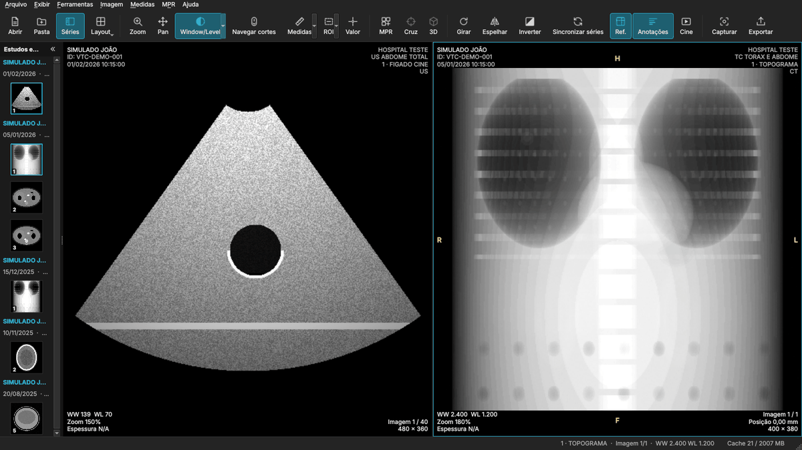
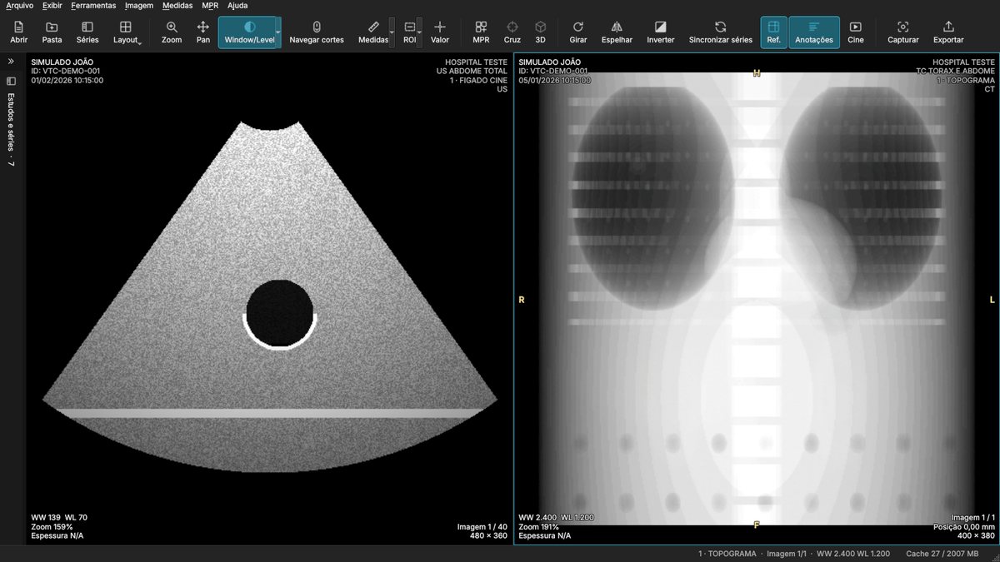

# Guia do usuário — VisualTC 0.4.0

> O VisualTC 0.4.0 é destinado a **estudos e pesquisas** e não é um
> dispositivo médico registrado. Confira medidas e reconstruções antes de
> qualquer uso diagnóstico. Criado por Dr Marcelo Duarte — Brasil.

## 0. Instalar

Baixe o arquivo do seu sistema na página de download (ou na seção "Baixar"
do README) e:

| Sistema | Arquivo | Passos |
|---|---|---|
| Windows 10/11 | `VisualTC-Setup-x64.exe` | clique duas vezes › **Avançar** › **Concluir**. Não pede senha de administrador; o VisualTC abre ao final e fica no menu Iniciar e na área de trabalho |
| Mac (chip Apple ou Intel, macOS 12+) | `VisualTC-macOS.dmg` | clique duas vezes e arraste o VisualTC para **Aplicativos**; abra pelo Launchpad |
| Ubuntu, Debian, Mint | `visualtc_amd64.deb` | clique duas vezes › **Instalar**; procure VisualTC no menu |
| Outras distribuições Linux | `VisualTC-x86_64.AppImage` | botão direito › Propriedades › *Permitir executar como programa*; clique duas vezes |

Se na primeira abertura aparecer um aviso de segurança — no Windows, "O
Windows protegeu o computador": **Mais informações › Executar assim mesmo**;
no Mac: **Ajustes do Sistema › Privacidade e Segurança › Abrir Mesmo
Assim**. Isso só é necessário uma vez (e não aparece nas versões assinadas).

Para desinstalar: Windows, *Configurações › Aplicativos*; Mac, arraste o
VisualTC de Aplicativos para o Lixo; Ubuntu, Central de Programas (ou
`sudo apt remove visualtc`); AppImage, apague o arquivo.

**No Mac**, onde este guia diz **Ctrl**, use a tecla **⌘ (Command)**: Ctrl+O
é ⌘O, Ctrl+L é ⌘L e assim por diante. Os menus já mostram os atalhos com ⌘.

## 1. Abrir um exame

- **Pasta** (Ctrl+Shift+O): escolha a pasta do CD/pendrive ou a pasta
  baixada do PACS. Todas as subpastas são lidas; não importa se os arquivos
  têm extensão `.dcm` ou nenhuma.
- **Abrir** (Ctrl+O): um ou mais arquivos, inclusive exames compactados.
- **Arquivo › Abrir exame compactado (ZIP, RAR, 7z)…**: o mesmo, já filtrando
  os arquivos compactados.
- **Arrastar e soltar** pastas, arquivos ou arquivos compactados na janela.
- **Windows:** botão direito no CD/DVD, no pendrive, numa pasta ou num
  ZIP/RAR/7z › **Abrir no VisualTC** (se marcado na instalação).
- **Mac:** arraste a pasta do CD ou o ZIP para o ícone do VisualTC no Dock,
  ou use "Abrir com › VisualTC" no Finder.
- Pela linha de comando: `VisualTC /caminho/do/exame`.

### Exames compactados

O VisualTC abre exames recebidos compactados — **ZIP**, **RAR**, **7z**, TAR,
TGZ, GZ, BZ2, XZ, ZST e imagens de CD **ISO** —, inclusive um arquivo
compactado dentro de outro. Não é preciso descompactar antes:

- Se o ZIP tiver senha, o VisualTC pede a senha (até três tentativas). RAR e
  7z com senha ainda não são suportados: descompacte-os antes com o programa
  do sistema.
- Só as imagens DICOM são extraídas, para uma pasta temporária do VisualTC,
  apagada ao fechar o exame (**Arquivo › Fechar estudos**) ou o programa. O
  arquivo compactado original não é alterado.
- Nas informações DICOM, o arquivo aparece como
  `exame.zip › DICOM/ST1/IM1`.
- Por segurança, arquivos compactados que se expandiriam além do espaço livre
  em disco ou de forma anormal ("bombas" de compressão) são recusados com uma
  mensagem.

A barra de status mostra o progresso. Ao final, a maior série (que não seja
topograma) abre automaticamente. Arquivos com problema não interrompem a
importação: o resumo informa quantos foram e o menu **Arquivo › Problemas de
importação** lista o motivo de cada um (corrompido, truncado, formato não
suportado…). Os arquivos originais nunca são alterados.

## 2. Painel de estudos e séries

À esquerda ficam paciente, estudo (data e descrição) e séries com miniatura,
modalidade, número de imagens, espessura e a marca **MPR** quando a série é
volumétrica. Avisos aparecem na própria série (ex.: "cortes ausentes",
"gantry tilt", "espaçamento irregular").

- **Duplo clique** abre a série no viewport ativo.
- **Arraste** a série para qualquer viewport.
- **Fechar um estudo**: o **×** à direita do nome do paciente fecha só aquele
  estudo (as imagens, o MPR e as cópias extraídas de arquivos compactados
  dele); os demais continuam abertos. Para fechar tudo: **Arquivo › Fechar
  estudos**.
- **Recolher o painel** para ganhar área de imagem: botão **«** no topo do
  painel, botão **Séries** na barra de ferramentas ou **F2**. O painel vira
  uma faixa estreita na borda; clique nela (ou em **»**, ou F2) para
  trazê-lo de volta.
- **Estreitar o painel**: arraste a borda entre o painel e as imagens. Abaixo
  de certa largura ficam só as miniaturas, com o número da série sobre cada
  uma (os detalhes continuam na dica ao passar o mouse).
- A largura e o estado (aberto/recolhido) são lembrados na próxima vez.
- O painel pode ser arrastado pelo título para a borda direita da janela.

| Painel só com miniaturas | Painel recolhido |
|---|---|
|  |  |
- O menu de contexto (botão direito) abre a série no viewport ativo,
  direto em MPR, ou mostra as informações DICOM.

Uma série DICOM com várias pilhas (ecos, fases, clipes de US, planos
diferentes) aparece dividida, com o motivo no nome (ex.: "Eco 2", "Clipe 3").

## 3. Navegação

| Ação | Como |
|---|---|
| Próximo/anterior corte | roda do mouse, setas ↑ ↓ ← →, ferramenta **Rolar** (S) e arrastar |
| Pular 10 % da série | Page Up / Page Down |
| Primeiro/último | Home / End |
| Cine | **Espaço**; velocidade, loop e sentido reverso no menu Imagem |
| Zoom | Ctrl+roda, botão direito arrastando, ferramenta **Zoom** (Z) |
| Pan | botão do meio, Shift+arrastar, ferramenta **Pan** (P) |
| Ajustar à janela / 1:1 | F / Shift+F |
| Reset da imagem | Ctrl+0 (ou **Exibir › Reset**) |
| Próximo viewport | Tab |
| Maximizar viewport | duplo clique (de novo para voltar) |
| Tela cheia | F11 (ou o atalho de tela cheia do sistema) |

O scroll sempre segue a ordem **anatômica** (posição de cada corte no
espaço), no mesmo sentido da numeração do equipamento. A posição em mm e
"Imagem X / N" ficam no canto inferior direito.

## 4. Window/Level e presets

- Ferramenta **Window/Level** (W) com o botão esquerdo: arrastar na
  horizontal muda a largura (WW), na vertical muda o centro (WL).
- Teclas **1–8** aplicam os presets de TC: 1 Pulmão, 2 Mediastino,
  3 Abdome, 4 Fígado, 5 Osso, 6 Cérebro, 7 Subdural, 8 AVC.
- Menu **Imagem › Presets de janela** traz também as janelas gravadas no
  arquivo DICOM e os presets personalizados (Preferências › DICOM).
- **VOI LUT do arquivo** usa a tabela VOI gravada pelo equipamento, quando
  existe.
- **Inverter** (I). Imagens MONOCHROME1 (algumas radiografias) já são
  exibidas corretamente; a inversão do usuário é aplicada por cima.
- **Tabela de cores (LUT)** — botão **LUT** na barra ou **Imagem › Tabela de
  cores (LUT)**: tons de cinza, ferro quente (Hot Iron), PET, arco-íris, osso,
  cobre, fogo e gelo. A cor é aplicada depois do window/level, só na tela:
  os valores, as medidas e o HU não mudam. Vale para imagens em tons de cinza
  (imagens já coloridas, como Doppler, ficam como estão). No MPR, a tabela
  escolhida vai para os três planos.

Os valores WW/WL exibidos estão em HU na TC.

## 5. Orientação e transformações

As letras nas bordas (R/L, A/P, H/F) são calculadas a partir da orientação
gravada no arquivo; em planos oblíquos aparecem combinações como "RA". Sem
orientação no arquivo, nenhuma letra é mostrada.

Girar 90° (] e [), rotação livre (menu Imagem), espelhar (H e Shift+H).
Enquanto a imagem estiver girada, espelhada ou invertida, um aviso
aparece no viewport e as letras de orientação acompanham a transformação.

## 6. Medidas e ROIs

| Ferramenta | Tecla | Uso |
|---|---|---|
| Régua | M | arraste do ponto inicial ao final; resultado em mm (ou cm) |
| Ângulo | A | arraste o primeiro segmento e clique no terceiro ponto |
| Cobb | C | arraste a primeira linha e depois a segunda |
| ROI retangular | R | arraste |
| ROI elíptica | E | arraste |
| ROI livre | L | desenhe segurando o botão |
| Valor do pixel | V | clique ou arraste: posição, valor e HU |

- As ROIs mostram área, média, desvio-padrão, mínimo e máximo (em **HU** na
  TC). Pixels fora da imagem são ignorados.
- **Histograma da ROI** (Ctrl+Shift+H, ou no menu do botão **ROI** e em
  **Medidas**): mostra a distribuição dos valores da ROI selecionada. Fica
  disponível assim que uma ROI é desenhada ou clicada.
- Clique numa medida para selecioná-la; arraste os pontos para editar, o
  corpo para mover e o texto para reposicioná-lo.
- **Delete/Backspace** apaga a selecionada; Ctrl+Shift+Del apaga todas;
  Ctrl+Z / Ctrl+Shift+Z (Ctrl+Y no Windows) desfazem e refazem.
- **Esc** cancela uma medida em andamento.
- As medidas ficam associadas à imagem em que foram feitas.

**Calibração.** As distâncias usam o PixelSpacing do arquivo. Se o arquivo
só tem o espaçamento no detector (algumas radiografias), aparece
**CALIBRAÇÃO NO DETECTOR** (não corrige a magnificação). Sem nenhuma
calibração, as medidas são mostradas em **pixels** e o aviso
**SEM CALIBRAÇÃO** aparece — o VisualTC nunca inventa um valor em mm.

## 7. Vários viewports, sincronização e linhas de referência

- **Layout** (barra de ferramentas ou Ctrl+1…Ctrl+7): 1×1, 1×2, 1×3, 2×1,
  2×2, 3×2, 3×3. Cada viewport guarda a sua série e o seu estado.
- **Plano** (botão na barra ou Ctrl+Shift+P): muda o plano da série do
  viewport ativo — cada clique passa para o seguinte (axial → sagital →
  coronal → axial); a seta ao lado do botão escolhe direto. O plano em que a
  série foi adquirida mostra as **imagens originais**; os outros são
  reconstruídos do volume da série (como no MPR, mas num único quadro). O
  nome do botão mostra o plano atual (ex.: "Plano: Sagital"). Funciona com
  séries marcadas como **MPR** no painel.
- **Sincronizar séries** (Y): ao navegar uma série, as outras do mesmo
  sistema de coordenadas (Frame of Reference) vão para o corte mais próximo
  **anatomicamente** — não para o mesmo número de imagem. Séries de outro
  exame ou sem coordenadas não são sincronizadas (o viewport indica isso).
  Zoom/pan e window/level podem ser sincronizados também (Preferências).
- **Linhas de referência** (botão **Ref.** ou Ctrl+L): a posição do corte
  ativo aparece como uma linha nas séries do mesmo exame em **outro plano**
  (ex.: o axial sobre o topograma ou sobre o coronal). Se só houver uma
  imagem na tela, ao ligar o botão o VisualTC abre ao lado a série em outro
  plano mais adequada (o topograma primeiro) para mostrar a linha. Séries
  paralelas (dois axiais) não têm linha de referência — para elas use
  **Sincronizar**. A barra de status explica quando não há linha a mostrar.

## 8. MPR

- **MPR** (Ctrl+M ou botão na barra) monta o volume da série ativa e mostra
  axial, coronal e sagital lado a lado. Disponível para séries marcadas
  como **MPR** no painel (cortes paralelos e coerentes). A seta ao lado do
  botão **MPR** abre as opções (MIP/MinIP, espessura, rotação).
- Em cada plano, as **linhas coloridas** mostram onde passam os outros dois
  (amarelo = axial, verde = coronal, azul = sagital). Tudo se faz com o mouse,
  direto sobre as linhas:

  | Arraste… | Resultado |
  |---|---|
  | a **linha** | move só aquele plano (o outro fica onde está) |
  | a **bolinha** na ponta da linha | gira os dois planos em torno do cruzamento: **MPR oblíquo**, em qualquer ângulo |
  | a **barrinha** ao lado da linha | dá **espessura** àquele plano (thick slab); as bordas aparecem tracejadas |
  | o **círculo central** | move o cruzamento (os dois planos ao mesmo tempo) |

  O cursor muda ao passar sobre cada parte, e um texto curto explica o que o
  arraste fará. Um clique fora das linhas leva o cruzamento até ali
  (ferramenta **Posicionar o cruzamento**, Shift+X, a padrão no MPR). As
  linhas também respondem com as ferramentas Window/Level, Zoom, Pan e
  Rolar; com as ferramentas de medida, os cliques ficam para as medidas.
- **Cruz** (botão na barra ou **X**): mostra ou oculta as linhas coloridas,
  para ver a imagem limpa. A escolha é lembrada.
- A roda do mouse percorre cada plano de forma independente.
- **Espessura e projeção**: cada plano tem a sua espessura (pela barrinha) e
  os três usam a mesma projeção — **MIP** (intensidade máxima), **MinIP**
  (mínima) ou **Média**, no menu MPR (ou na seta ao lado do botão **MPR**).
  Escolher MIP ou MinIP com os planos finos já aplica 10 mm. A seção
  **Espessura dos três planos** do mesmo menu aplica a mesma espessura a
  todos (plano fino, 1–50 mm ou personalizada até 500 mm). Escolhida com o
  MPR fechado, a opção abre o MPR da série ativa já com ela. O valor aparece
  no canto de cada plano.
- **Planos oblíquos pelo teclado**: Ctrl+[ e Ctrl+] giram os outros dois
  planos em 5° em torno do plano ativo; **MPR › Restaurar planos ortogonais**
  desfaz qualquer rotação. Ao girar, os planos mantêm a escala da imagem.
- Gantry tilt e espaçamento irregular são reconstruídos nas posições reais
  dos cortes; regiões de cortes ausentes ficam pretas (nunca interpoladas).
- Clique em **MPR** novamente para voltar à visualização 2D.

## 9. Exportar e copiar

- **Exportar imagem** (Ctrl+E): PNG, JPEG ou TIFF do viewport ativo, com
  opções de incluir medidas/textos e de **ocultar a identificação do
  paciente**.
- **Arquivo › Copiar imagem do viewport** (Ctrl+Shift+C): copia a imagem
  para a área de transferência.
- **Informações DICOM** (Ctrl+I): principais atributos da imagem atual.

## 10. Preferências

| Aba | Opções |
|---|---|
| Interface | **idioma** (português, espanhol ou inglês; vale ao reiniciar — o VisualTC oferece reiniciar na hora), **cor de destaque**, tema escuro/claro, tamanho da fonte |
| Mouse | ação dos botões esquerdo, do meio e direito |
| Desempenho | tamanho do cache, pré-carregamento da série, threads, interpolação, decodificação isolada, qualidade do MPR |
| DICOM | textos sobre a imagem, linhas de referência, sincronização de zoom/pan e janela, presets personalizados |

**Cor de destaque**: a cor dos botões ativos da barra, da seleção e do nome
do paciente — azul, sépia, amarelo, dourado, verde neon ou laranja. Também
em **Exibir › Cor de destaque**; muda na hora.

**Idioma**: na primeira vez, o VisualTC usa o idioma do sistema (português,
espanhol ou, para os demais, inglês); quem já usava uma versão anterior
continua em português. Os números seguem o idioma (vírgula decimal em
português e espanhol).

## 11. Atalhos

| Tecla | Função | Tecla | Função |
|---|---|---|---|
| Ctrl+O | Abrir arquivos | Ctrl+Shift+O | Abrir pasta |
| F2 | Recolher/mostrar o painel de séries | Ctrl+1…7 | Layouts |
| W | Window/Level | P | Pan |
| Z | Zoom | S | Rolar cortes |
| M | Régua | A | Ângulo |
| C | Cobb | R | ROI retangular |
| E | ROI elíptica | L | ROI livre |
| V | Valor do pixel | X | Cruz: mostrar/ocultar as linhas do MPR |
| I | Inverter | F / Shift+F | Ajustar / 1:1 |
| ] / [ | Girar 90° | H / Shift+H | Espelhar |
| Espaço | Cine | O | Textos sobre a imagem |
| Y | Sincronizar | Ctrl+L | Linhas de referência |
| Ctrl+M | MPR | Ctrl+[ / Ctrl+] | MPR oblíquo ±5° |
| Ctrl+Shift+P | Plano: axial → sagital → coronal | Shift+X | Posicionar o cruzamento (MPR) |
| 1–8 | Presets de TC | Ctrl+0 | Reset |
| Ctrl+E | Exportar | Ctrl+Shift+C | Copiar imagem |
| Ctrl+Shift+H | Histograma da ROI | Ctrl+I | Informações DICOM |
| Ctrl+Z | Desfazer | Delete | Apagar medida |
| Esc | Cancelar / ferramenta padrão | Tab | Próximo viewport |

A lista também está em **Ajuda › Atalhos de teclado**. Em telas estreitas
(notebook de 13"), os botões menos usados da barra mostram só o ícone; o
nome aparece ao parar o mouse sobre eles.

## 12. Privacidade e log

O VisualTC não acessa a internet. O log técnico (`visualtc.log`, local
indicado em **Ajuda › Local do arquivo de log**) não contém nomes, IDs,
datas nem identificadores do exame.
